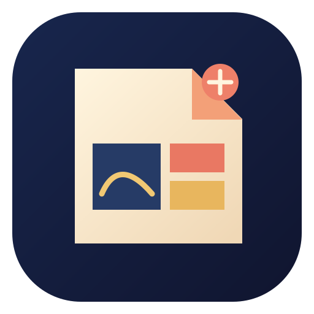

<p align="center">
  
</p>

<h1 align="center">imanganation-gimp</h1>

<p align="center">
  <strong>A GIMP 3 fork built as a manga creation studio</strong><br>
  Script to finished page, with local AI panel rendering, in one app.
</p>

<p align="center">
  
</p>

**Imanganation** turns a written script into manga pages. This repository is the
GIMP half: a fork of [GNOME GIMP](https://gitlab.gnome.org/GNOME/gimp) with a manga
workspace, page and panel navigation, and the dockable tools that drive the
[Imanganation engine](https://github.com/imattau/imanganation). The engine renders each
panel on your own machine through ComfyUI, with consistent characters, and you finish
the page in GIMP: screentone, lettering, speech bubbles and the cover.

## What the fork adds

- **Manga workspace.** A project navigator, a page strip along the bottom dock and a
  compact toolbox, laid out for page work.
- **Project containers.** Open an `.imanga` project: its script, pages, characters and
  panels, with a welcome dialog to start a new one.
- **Extension panels.** Python plug-ins can own dockable panels with trees, tile
  strips, editable properties, right-click menus and drag to reorder.
- **Branding.** The Imanganation icon, About logo and splash screen (in `branding/`).

The Imanganation plug-in (script import, panel rendering, inpainting, characters,
lettering, tone and effects) lives in the engine repository and installs into this build.

## Install

The easiest route is the single-file Flatpak, which bundles GIMP, the plug-in, the engine
and ComfyUI. It runs on any Linux distribution; get it from the
[engine repository's releases](https://github.com/imattau/imanganation/releases).

```bash
flatpak install --user imanganation-gimp.flatpak
```

To build it yourself, see `packaging/flatpak` in the engine repository.

## Building from source

This is GIMP's own build system (Meson), so GIMP's build instructions apply: see
[`INSTALL`](INSTALL) and [`devel-docs/README.md`](devel-docs/README.md). The branding
assets install through `branding/meson.build`.

## Upstream and licence

Based on GIMP, the GNU Image Manipulation Program, tracked from
[GNOME/gimp](https://gitlab.gnome.org/GNOME/gimp). Imanganation is not affiliated with
the GIMP project. Licensed under the same terms as GIMP: GPLv3 or later for the
application and LGPLv3 or later for the libraries (see [`COPYING`](COPYING)). GIMP's
original readme is kept in [`README`](README).
